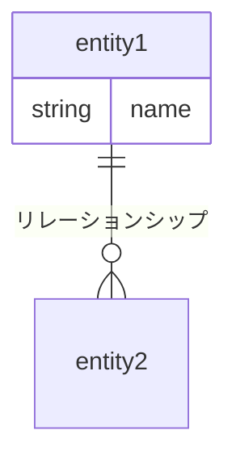

## はじめに

あけましておめでとうございます。テクノロジーグループ所属、鈴木陸斗です。

SCCでは、半年間の努力と成果を定量的に量るために、目標管理シートを作成します。私は、その実施内容の一環として、あるテーマに沿って学習を行い、その成果をまとめてよろずやブログに掲載するという目標を定めました。

今回は、データモデリングの観点を中心に、データベース設計について学習したことをまとめていこうと思います。

### 目次

1. データモデリングの目的
2. ビジネス活動をER図で表現する
3. ３つのデータモデリング
4. データモデリングの考え方・手法
    1. 5W1Hを意識する
    2. エンティティを分類する
    3. イベントに注目する
    4. イミュータブルデータモデル

## データモデリングの目的

企業は、経営判断や意思決定を行うために、ビジネス活動から発生したデータを活用しようとします。データを活用にするためには、効率的にデータを収集・保存する必要があります。

データモデリングでは、企業のビジネス活動で発生するデータと、そのデータの流れを整理し、視覚的に表現することで、効率的にデータを収集・保存できるようにします。

したがって、データモデリングの目的は次のようになります。

1. **企業のビジネス活動をもとに、収集するデータを整理する**。
2. **企業のビジネス活動をもとに、データの流れを整理する。**
3. **抽象的なイメージを図式化し、視覚的に表現する。**

## ビジネス活動をER図で表現する

一般的に、データモデリングで図式化を行う場合、ER図が利用されます。ER図の構成要素は、エンティティとリレーションシップで表されます。

1. エンティティ
    
    システム化対象範囲で管理するデータを、**エンティティ**と呼びます。下図で言えば、四角形で囲まれたものがエンティティです。また、エンティティで管理される要素を**属性**といいます。エンティティは、社員・顧客といった経営資源（リソース）や、購入・出荷といったビジネス活動（イベント）が対象になります。
    
2. リレーションシップ
    
    エンティティとエンティティを結ぶ線を**リレーションシップ**といいます。
    

図

## ３つのデータモデリング

データモデリングは、概念データモデリング・論理データモデリング・物理データモデリングの３つに分けられます。それぞれのデータモデリングは、システム開発工程と対応して行われます。

### 概念データモデリング

概念データモデリングでは、次のことを行います。

- システム化の対象範囲にあるデータを洗い出す
- 格納するデータを決定する
- データの発生から行先までを図式化する。
- データがどのように関連しあっているかを整理する（従属関係の整理）

ここで重要なことは、ビジネスの視点で設計を行うことです。テーブル・インデックスなどシステム的な観点の仕様決定は、物理データモデリングの工程で行います。

### 論理データモデリング

論理データモデリングでは、概念データモデリングで作成した概念データモデルをベースに、次のことを行います。

- 正規化
- 安定化検証

論理データモデリングも概念データモデリングと同様に、ビジネスの視点でデータを整理すること重要です。

### 物理データモデリング

物理データモデリングでは、論理データモデリングで作成した論理データモデルをベースに、システムとして目的を達成するための調整を行います。

物理データモデリングでは論理データモデリングとは対照的に、システムの視点でモデリングを行います。

## データモデリングの手法・考え方

### 5W1Hを意識する

エンティティと、エンティティに格納される属性を洗い出すときは、**5W1H**を意識しましょう。

- who：社員、顧客
- what：商品
- when：年、月、日付、日時
- where：営業所、拠点、宛先、URL
- why：受注、出荷
- how：請求書、注文書

### エンティティを分類する

エンティティは、**リソース**と**イベント**に分けられます。分類を行うことで、次のようなメリットがあります。

**メリット**

- イベントに注目してデータを整理しやすくなる（後述）
- 永続化対象の判断がしやすくなる

**分類の方法**

分類の方法はエンティティが**日時属性**を持つかどうかで判断します。ここで、日時属性とは、有効期限・予定日・開始日・終了日など、データのライフサイクルを表すものは日時属性ではありません。あくまで、**イベントが発生した日時を記録したもの**が日時属性です。

**永続化の対象**

基本的に、リソースはすべて永続化の対象となります。一方、イベントは永続化しなくてもよいものも存在します。データを記録・管理するにもお金がかかるので、必要に応じて取捨選択したいところです。

永続化の要否の判断は次のことを意識しましょう。

- そのイベントが利益を生むものであるか
- そのイベントを記録しておかない場合、利益を損なうリスクがあるか

### イベントに注目する

データモデリングを行うとき、全体の関係を把握することは頭を悩ませる問題の一つです。このような場合、**イベントに注目する**と整理がしやすくなります。

リソースから関係を整理しようとすると、考えが発散してしまい、設計ミスにつながります。

- 購入（イベント）があったとすると、購入者（リソース）や商品（リソース）と結びつく　イベントからリソースを関係を整理する
- 購入イベントのあと、出荷イベントが発生する。　イベントが発生する時間軸で、前後関係を整理する
    
    →これは図として表現する。
    

### イミュータブルデータモデル

イミュータブルデータモデルは、システムでもっとも複雑になる更新処理（UPDATE）を、できるだけ排除することを方針としたデータモデリングの手法です。

イミュータブル（immutable：変更不可能な）

**イミュータブルデータモデルのポイント**

- イベントに一つだけ日時属性を持たせ**、**INSERTだけ行われるようにする**。**
- リソースに隠れているイベントも、別のエンティティとして分割する。
- 非依存リレーションシップは交差エンティティにする

[https://scrapbox.io/kawasima/イミュータブルデータモデル](https://scrapbox.io/kawasima/%E3%82%A4%E3%83%9F%E3%83%A5%E3%83%BC%E3%82%BF%E3%83%96%E3%83%AB%E3%83%87%E3%83%BC%E3%82%BF%E3%83%A2%E3%83%87%E3%83%AB)　

## 参考文献

[https://ja.wikipedia.org/wiki/データベース設計](https://ja.wikipedia.org/wiki/%E3%83%87%E3%83%BC%E3%82%BF%E3%83%99%E3%83%BC%E3%82%B9%E8%A8%AD%E8%A8%88)

[https://thinkit.co.jp/story/2010/10/07/1788?nopaging=1](https://thinkit.co.jp/story/2010/10/07/1788?nopaging=1)

[https://zenn.dev/cacbahbj/articles/9a17170967fb50](https://zenn.dev/cacbahbj/articles/9a17170967fb50)
